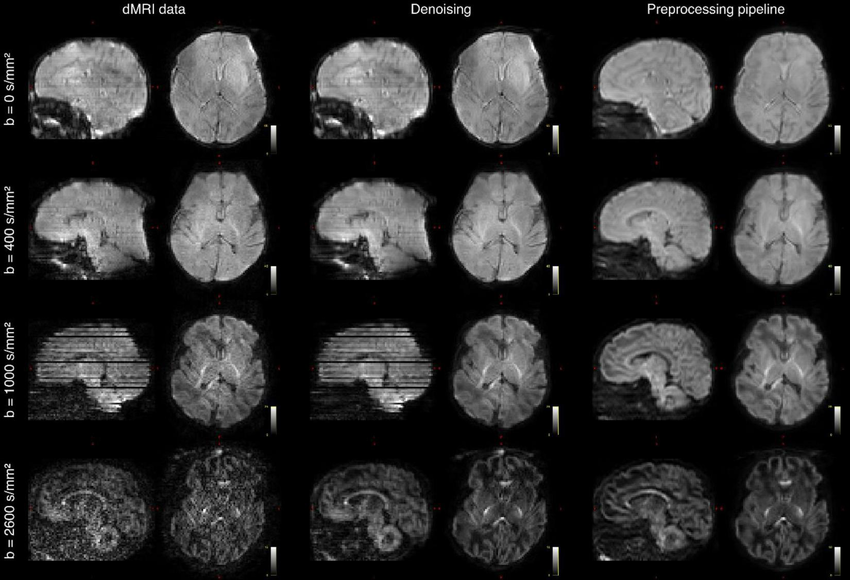
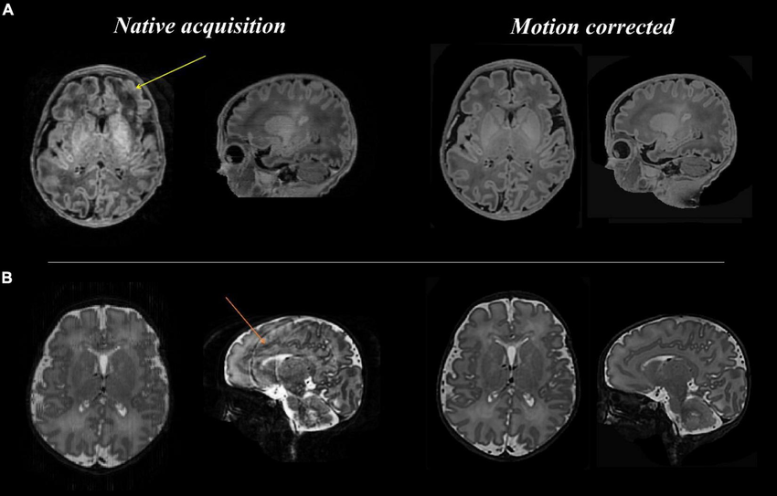
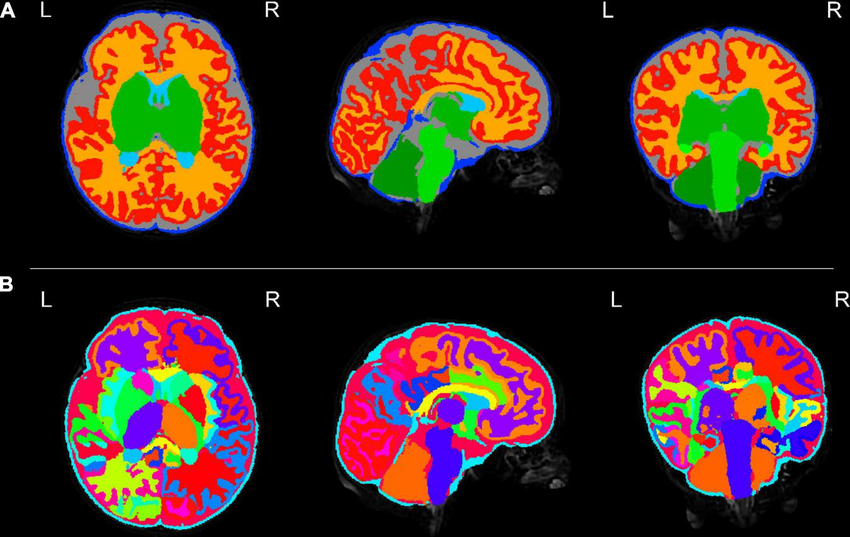
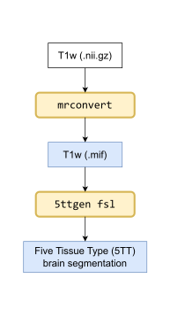
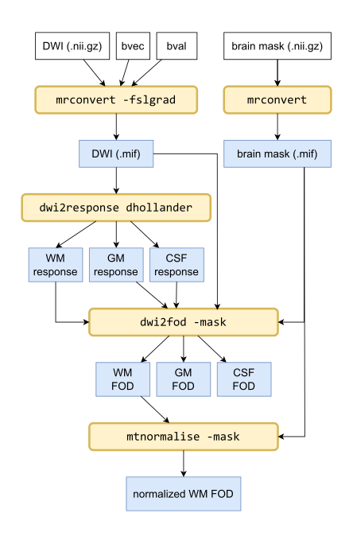
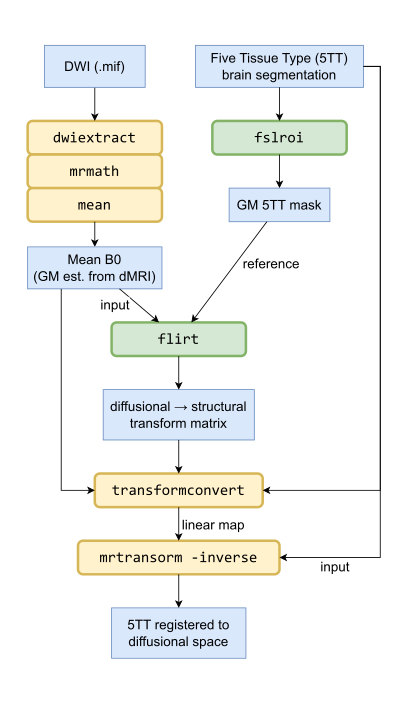
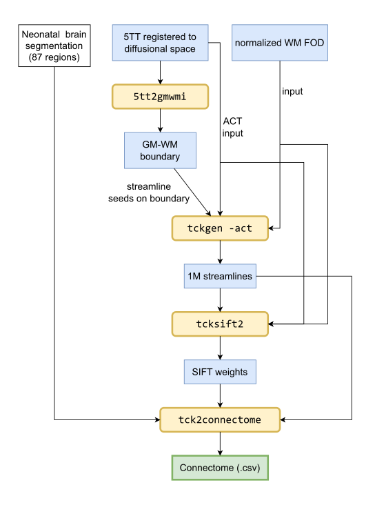

# Decoding Neonatal Brain Development: Preprocessing

This repository contains code for transforming the raw and semi-processed brain MRI images from the Developing Human Connectome Project (dHCP) [3rd data release](https://www.developingconnectome.org/data-release/third-data-release/) into brain connectivity data ready for modeling via Machine Learning (ML).

It uses CLI utilities from [FSL](https://fsl.fmrib.ox.ac.uk/fsl/docs/) and the open source [MRtrix](https://www.mrtrix.org/) brain imaging suite. The [`create_connectomes.py`](create_connectomes.py) script orchestrates the steps of the pipeline, along with multithreading and completion tracking.

A brief explanation of the steps can be found below, with more details and background information in Chapter 1 and 2 of my final [thesis](thesis.pdf).

## Table of Contents
- [Preprocessing steps](#preprocessing-steps)
  - [Anatomical pipeline](#anatomical-pipeline)
  - [Diffusional pipeline](#diffusional-pipeline)
  - [Coregistration](#coregistration)
  - [Combined pipeline](#combined-pipeline)
- [Installation](#installation)

## Preprocessing steps

The script uses data from the dHCP *anatomical pipeline* (sMRI) and *diffusional pipeline* (dMRI) in the NIfTI (.nii.gz) file format. An example for diffusional and structural MRI, along with the segmentation of the brain into functional regions can be seen below.

In the flowcharts below, white rectangles denote input files as found in the data release, while blue rectangles denote intermediate results. The operations are illustrated as either rounded yellow (MRtrix) or green (FSL) rectangles.

### Anatomical pipeline

The T1-weighted MRI image from the anatomical pipeline is segmented into volumetric masks for the five brain tissue types (5TT) based on magnetic resonance characteristics. 

### Diffusional pipeline

The diffusion-weighted MRI image (DWI) is converted into a vector field representing the approximate direction of white matter bundles crossing through the given voxel. The vector is represented as a probability density map denoted as Fiber Orientation Density (FOD).

### Coregistration

A rigid body transform must be calibrated between the diffusional and structural/anatomical images. This is used to apply the five tissue segmentation map from before to the dMRI image.

### Combined pipeline

Given the FOD and 5TT images from before, along with the segmentation of the subject's brain into 87 functional regions (released as part of the dHCP data release, with regions defined according to standard anatomical atlases), approximate streamlines are generated based on the probabilistic direction of axonal bundles, then the approximated density of neural connections between each pair of functional regions (the *connectome*) is saved. 

## Installation

To run the code, create a `conda` environment based on [`mrtrix.yml`](mrtrix.yml) and install the FSL utility separately based on your OS distribution (it is recommended to run the code on Linux, or within a Linux container).

After downloading the dHCP data release as described on the project homepage, set the relevant paths in the global variables inside  [`create_connectomes.py`](create_connectomes.py) and run the script.